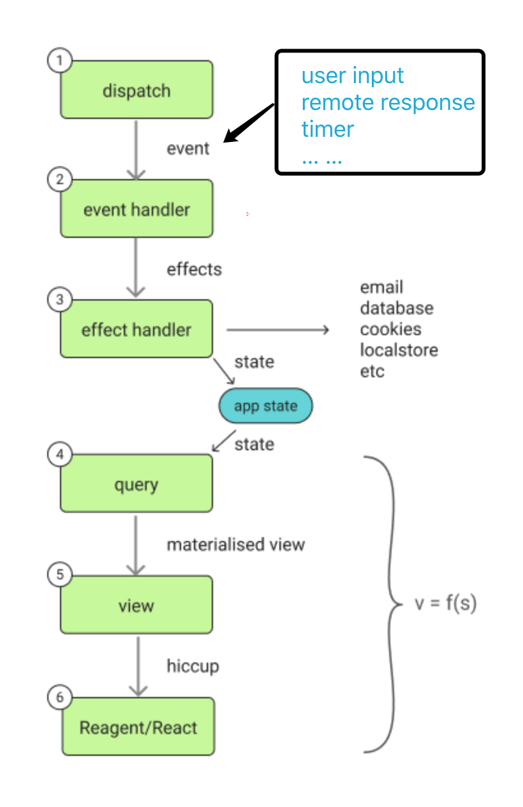

## re-frame介绍

re-frame是一个帮助我们快速开发WEB单页面应用的框架，是一个基于数据驱动的框架。其主要流程是如下的一个永无止境大循环：



### dispatch——事件分发

事件来源：用户输入、用户点击、定时器、远程调用响应等。事件作为一个数据被投入到类似于事件总线的队列，其数据结构为：

```clojure
[event-id event-arg1 event-arg2 ...]
```

re-frame事件分发函数：

```clojure
(re-frame.core/dispatch [event-id event-arg1 event-arg2])
```

### event-handler——事件处理

对于分发过来的事件，re-frame会根据事件ID(`event-id)找到注册的事件处理函数，进行处理。event-handler是整个应用的业务核心，re-frame使得事件处理过程变成了一个纯函数（稳定、可测试）。

```clojure
(defn remove-item
  "删除元素事件处理"
  [coeffects event]               ;; `coeffects` holds the current state of the world.  
     (let [item-id (second event)         ;; extract id from event vector
           db      (:db coeffects)]       ;; extract the current application state
       {:db  (dissoc-in db [:items item-id])
        :request {:request-id :some-thing}}))))

;; 注册事件处理
(re-frame.core/reg-event-fx   ;; a part of the re-frame API
  :remove-item                   ;; event id
  remove-item)  
```

事件处理函数的输入参数：`[coeffects event]`

* coeffects：包含了事件处理函数执行时当前"世界"的全部状态，包括`db(应用的本地状态)`以及其他事件处理上下文数据，如当前时间，随机数等...

  ```clojure
  {:db app-state ;; 当前app的状态，re-frame默认设置的
   :now 事件执行时的时刻 ;; 需要自定义注册
   :random-num 随机数  ;; 需要自定义注册
   ...
   }
  ```

* event：事件，参见上述`事件数据结构`。

事件处理函数拿都输入参数中的数据，通过计算之后，输出effects，如：

```cloju
{:db new-db ;; 更新应用状态的效果
 :request request-data ;; 远程调用的效果
 :cookie cookie-data ;; 更新cookie的效果
 :timer timer-data ;; 启动或关闭定时器的效果
 ...}
```

即用一个数据结构来描述事件处理之后要做的一些"副作用"操作，而不是直接在事件处理函数中调用这些副作用操作，如修改数据库，执行远程调用，修改cookie的值，这样会使得事件处理函数变成非纯函数。

PS：上述结构中，key为effect的ID，标志一类effect。

### effects handler——效果处理

re-frame会根据effect id 找到事先注册好的效果处理函数，对效果进行处理。如对于`:db`这个默认的效果，re-frame会用新的db替换旧的db(这是re-frame的默认处理)。对于那些自定义效果，则需要注册自定义处理函数，以远程调用效果request为例：

```clojure
(defn request-effect-handler
  "远程调用效果处理函数"
  [{:keys [event params resp-event] :as request-data}]
    (case event
      :query-user-balance
      ;; 模拟远程调用
      (js/setTimeout #(re-frame/dispatch [resp-event 20000]) 5000)))

;; 注册效果处理函数
(re-frame/reg-fx
  :request         ;; effect id
  request-effect-handler)
```

效果处理完之后，应用的状态被更新改变。

### query——查询应用状态中用于显示的相关数据

应用状态被更新之后，负责显示的视图层会从新的状态中，查找出它展示所需要的数据：

```clojure
(defn query-fn
	"定义从应用状态db中查询出所需数据函数"
  [db]         ;; db is current app state
  (:items db))   ;; not much of a materialised view

;; 注册查询函数
(re-frame/reg-sub
  :query-items ;; 查询ID :query-id
  query-fn)

;; 因为clojure中关键字也可以作为函数，所以上面的代码等价于：
(re-frame/reg-sub :query-items :items)

```

### view——生成新的视图

视图层根据query-id订阅所需要的数据，然后根据数据生成新的视图：

```clojure
(defn items-view
  "定义视图生成函数"
  []
  (let [items  (re-frame/subscribe [:query-items])]  ;; source items from app state
    [:div (map item-render @items)]))   ;; assume item-render already written
```

`subscribe`函数向应用状态中订阅query-id(:query-items)指定的数据，每当应用状态中这个数据发生改变时，都会重新生成新的视图。

### Reagent/React——渲染视图

生成的新的视图会被重新渲染到DOM，展现给用户：

```clojure
(reagent/render [views/items-view] (.getElementById js/document "app"))
```


## 示例Demo1——[re-frame simple template](<https://github.com/SnaiLiu/re-frame-example1/tree/master/re-frame-example1>)

## 示例Demo2——[Demo1重构后的版本](<https://github.com/SnaiLiu/re-frame-example1/tree/master/example1-refactor>)

### 为什么重构？

* `re-frame`应该作为一个集成性架构来使用，不应该分散在代码的各个单元、甚至是函数中，"污染“了代码。
* view单元和event-handler单元，应该都是以纯函数形式存在。
* 精简代码。

## re-frame核心设计思想：数据

* 应用状态`db`驱动页面渲染，db数据是怎样，页面就渲染成什么样。
* 事件驱动：事件一个数据结构的形式在应用中流动，驱动这应用状态的前进。
* 在re-frame中，事件、事件处理函数、效果、效果处理函数、应用的状态、coeffects…这些都被当做数据来处理、注册。


